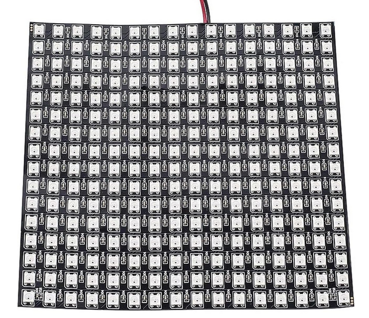
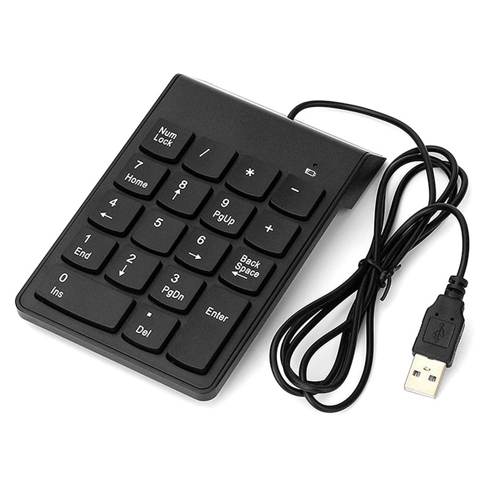
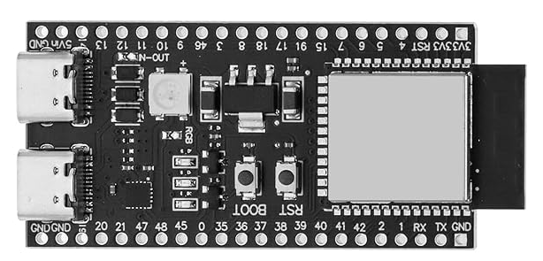

# Konzept EwtP Projekt 2025 "Tic Tac Toe Extended"

## Bedienung

### Darstellung

Für die Darstellung wird eine 16x16 "Neopixel" Matrix verwendet.

Neben dem 9x9 Spielfeld können auf dieser zusätzliche Informationen angezeigt werden.

### Eingabe

Für die Eingaben wird das Numpad einer über USB an den Microcontroller angeschlossenen Tastatur verwendet.

## Implementation

### MCU

Als MCU wird ein ESP32-S3 auf dem DevKitC-1-N16R8 verwendet.

### Software

Die Spiellogik wird in Matlab und/oder Simulink entwickelt.

Es wird eine Firmware in Rust geschrieben, welche die Hardware ansteuert und den Matlab/Simulink code aufruft.

Dabei verwaltet der Matlab Code den abstrakten Spielzustand und die Firmware ist dafür zuständig, diesen in ein Pixel Muster zu rendern und über die Pixelmatrix anzuzeigen.

Der Matlab Code hat daher keinerlei Kentnisse über die tatsächliche Laufzeitumgebung.

Für Testzwecke kann der gleiche Matlab Code auch auf dem Computer ausgeführt werden.